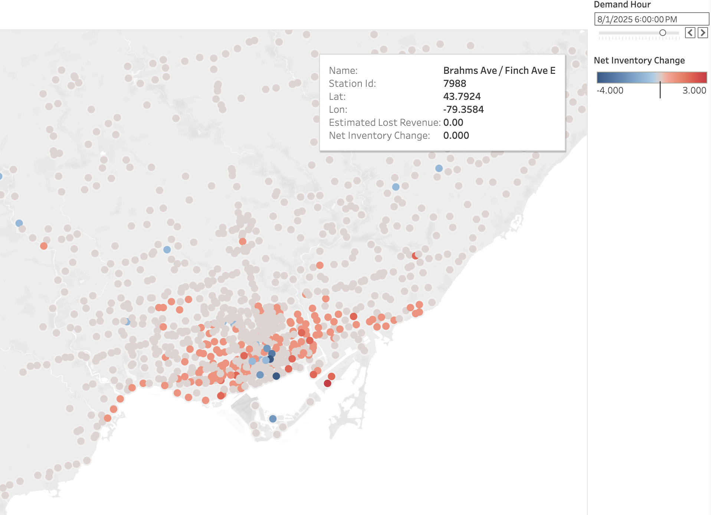

# 🚲 Proactive Bike Share Logistics Engine


**Live Executive Dashboard:** [https://public.tableau.com/app/profile/minsu.kim8285/viz/ProactiveBikeShareLogisticsEngine/Sheet1]

An end-to-end data architecture and predictive machine learning pipeline built to optimize urban logistics, forecast station inventory, and shift network dispatching from a reactive to a proactive model.

## 📌 Executive Summary
City bike-share networks lose revenue in two primary ways: Stockouts (empty stations) and Overflows (full stations). Currently, urban dispatch logistics operate *reactively*—trucks are only deployed after a station has completely drained, resulting in unfulfilled demand during peak commuting hours.

This project bridges data engineering and machine learning to forecast exact station inventory changes 24 hours in advance. It calculates the "Estimated Lost Revenue," allowing dispatch operators to dynamically compare the financial risk of a stockout against the operational cost of sending a dispatch truck.

### 📊 Key Business Outcomes:
* **Operational ROI:** Mathematically optimized a **$120 truck dispatch cost** by translating predicted station deficits into a financial "Lost Revenue" metric via a Tableau heuristic engine.
* **Predictive Accuracy:** Achieved a highly precise Mean Absolute Error (MAE) of **1.92 bikes** by engineering a rolling 2-hour momentum feature, granting the AI "short-term memory" to react to real-time grid conditions.
* **Data Governance:** Intercepted and quarantined mechanical API glitches (e.g., broken docks recording 1,000-hour trips) across **1.1M+ transaction records** using an automated Python IQR isolation script.

---

## 🏗 System Architecture & Directory

```text
bike_share_logistics_engine/
├── .env                       # Local database credentials (Ignored by Git)
├── .gitignore                 # Enterprise security and system file exclusions
├── README.md                  # Project documentation and setup guide
├── requirements.txt           # Strict version-pinned Python dependencies
├── assets/                    # Rendered UI components for repository documentation
│   └── dashboard_preview.png  # Tableau geospatial network dashboard preview
├── data/                      # Local data storage (Ignored by Git for security)
│   ├── processed/             # ML feature matrices and Tableau feeds
│   ├── quarantine/            # Anomalous records failing IQR checks
│   └── raw/                   # Raw API and historical transaction ledgers
├── models/                    # Serialized Machine Learning Ecosystem
│   └── xgboost_inventory_model.pkl # Production-ready trained regressor
├── notebooks/                 # Exploratory Data Analysis & Prototyping
│   ├── generate_eda_visual.py # Script generating statistical data profiling plots
│   └── trip_outliers_plot.png # Visual output of IQR distribution and anomalies
├── scripts/                   # Automated Environment Utilities
│   └── generate_requirements.py # Custom Python script for strict dependency tracking
├── sql/                       # Relational Database Architecture & ELT Scripts
│   ├── asset_trajectories.sql # Window functions tracking physical assets
│   ├── business_metrics.sql   # Aggregation queries for operational ROI
│   └── create_tables.sql      # PostgreSQL schema initialization
├── src/                       # Core Python ETL & Governance Engine
│   ├── build_features.py      # Feature engineering (rolling momentum, temporal)
│   ├── data_quality.py        # IQR anomaly detection and routing
│   ├── deploy_forecast.py     # Inference script for live predictions
│   ├── extract_for_tableau.py # Output generator for BI consumption
│   ├── ingestion_stations.py  # API ingest for static physical nodes
│   ├── ingestion_trips.py     # Transactional ledger ingestion
│   ├── ingestion_weather.py   # Climate data integration for model features
│   ├── load_to_postgres.py    # Database connection and insertion logic
│   └── train_model.py         # XGBoost Regressor training pipeline
└── tests/                     # Validation & Quality Assurance
    └── test_data_quality.py   # Unit tests for IQR boundary limits and pipeline
```

---

## 🛠 Core Features & Tech Stack

### 1. Automated Data Governance (`data_quality.py`)
* **Tech:** Python, Pandas, Numpy
* **Function:** Ingests raw trip ledgers and enforces strict logical boundaries. Automatically isolates impossible physical events and routes them to a quarantine directory, protecting warehouse integrity.

### 2. Relational Data Warehouse (`PostgreSQL`)
* **Tech:** PostgreSQL, SQL (DDL, Window Functions)
* **Function:** A Star Schema database. Engineered advanced SQL window functions (`LEAD`, `LAG`) to chronologically track the precise physical trajectory and idle time of individual bicycles across the city.

### 3. Predictive Logistics Modeling (`XGBoost`)
* **Tech:** Python, XGBoost, Scikit-Learn
* **Function:** Engineered temporal schedules and rolling recent-departure momentum features. Trained an XGBoost Regressor predicting `net_inventory_change` to prevent the compounding error of forecasting inbound and outbound flows separately.

### 4. Executive BI Dashboard (`Tableau`)
* **Tech:** Tableau Public
* **Function:** A geospatial executive dashboard featuring a 24-hour interactive time-slider. Instantly quantifies the exact "Estimated Lost Revenue" at any given hour, allowing dispatchers to triage the geographic network.

---

## 📸 Dashboard Previews

> **Predictive Network Map:** Visualizing hourly stockout risks and estimated revenue loss.
> <br>

---

## 🚀 Local Deployment & Setup

> **⚠️ Data Privacy & Compliance Notice**
> The massive 3GB raw transaction dataset and the local `.env` database credentials have been strictly excluded from this repository via `.gitignore` to comply with operational security and GitHub storage limits. The source code is provided for architectural demonstration. 

**1. Clone the repository**
```bash
git clone [https://github.com/Minsu-Kim-Analyst/bike_sharing_logistics_engine.git](https://github.com/Minsu-Kim-Analyst/bike_sharing_logistics_engine.git)
cd bike_sharing_logistics_engine
```

**2. Establish the isolated virtual environment**
```bash
python3 -m venv env
source env/bin/activate  # On Windows use: env\Scripts\activate
```

**3. Freeze and audit dependencies automatically**
```bash
python scripts/generate_requirements.py
pip install -r requirements.txt
```

**4. Configure secure environment variables**
Create a `.env` file in the root directory to map your local PostgreSQL instance:
```text
DB_USER=postgres
DB_PASS=your_secure_password
DB_HOST=localhost
DB_PORT=5432
DB_NAME=bike_share_dw
```

**5. Execute the ETL and ML Pipeline**
```bash
python src/ingestion_trips.py
python src/data_quality.py
python src/train_model.py
```

---
*Developed as a comprehensive Business Analytics and Data Engineering portfolio initiative.*